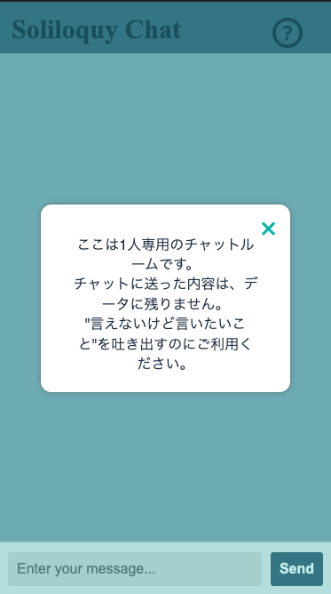
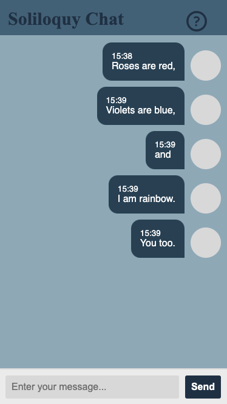
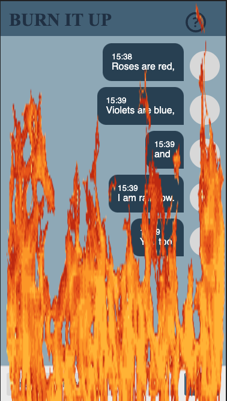

# soliloquy

## 　どんなApp？

***「誰かに言いたいけど、誰にも言えない...」***

***「どこかに吐き出したいけど、デジタルタトゥーは残したくない」***

そんな時に使える、データの残らないその場限りのチャットルームを作りました。

吐き出すだけでなく、もっとスッキリしたいときは、"Soliloquy Chat"タイトルを押して、燃やしてしまいましょう。

PC・スマートフォンどちらでも使用できます。

## 使い方

こちらからアクセスできます。

[Soliloquy App](https://soliloquy-chat.onrender.com)

1. 通常の画面
    
1. 右上の?ボタンを押すと現れるポップアップ
    
1. メッセージを入力すると、入力時間とともに画面に反映される。
    
1. 左上の"Soliloquy Chat"というタイトル部分を押すと、"BURN IT UP"というタイトルに変わり、チャット画面に火が上がる。
    
1. 燃やすギミックが起こるか、ページを再読み込みするとチャットのメッセージは消え、データも残らない。

## デプロイ先

- render

## めちゃめちゃ参考CodePen

chat
( https://codepen.io/sajadhsm/pen/odaBdd )

fire
( https://codepen.io/simeydotme/pen/PoyzbPM )